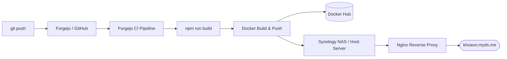

<div align="center">

# ⚡ KHOA.VO — Dual Persona Portfolio

**An immersive, dual-persona interactive portfolio built with React 18, Vite 6, Three.js WebGL, and Framer Motion.**

[](https://khoavo.myds.me)
[](https://hub.docker.com/r/vndangkhoa/kv-cv)
[](https://git.khoavo.myds.me/vndangkhoa/kv-cv)
[](https://github.com/vndangkhoa/kv-cv)
[](CHANGELOG.md)
[](LICENSE)

<br />

<p align="center">
  <a href="#-core-features">Features</a> •
  <a href="#-personas">Personas</a> •
  <a href="#-tech-stack">Tech Stack</a> •
  <a href="#-quick-start-with-docker">Docker</a> •
  <a href="#-local-development">Development</a> •
  <a href="#-project-structure">Structure</a> •
  <a href="#-deployment">Deployment</a>
</p>

</div>

---

## 🌟 Overview

**`kv-cv`** is a single-page web experience engineered to bridge two worlds:
1. **Creative Direction & AI Innovation Lead** — Editorial bento layouts, cinematic scrollytelling, progressive image reveal, and luxury design interactions.
2. **Full-Stack Developer & DevOps Architect** — High-contrast phosphor-green CRT aesthetics, draggable desktop windows, live repository metrics, and a fully interactive terminal CLI.

The site is served as a high-performance static SPA powered by Vite and Nginx, containerized with multi-stage Docker builds, and automatically synchronized across self-hosted Forgejo, GitHub, and Docker Hub.

---

## ✨ Core Features

<table>
  <tr>
    <td width="50%">
      <h3>🎭 Dual Persona Switcher</h3>
      <p>Seamlessly toggles between <b>Creative</b> and <b>Dev/IT</b> identities. Each persona re-skins the entire application — modifying navigation, typography, hero banners, project cards, and philosophical narratives.</p>
    </td>
    <td width="50%">
      <h3>🎥 Velocity Scrolly Video</h3>
      <p>Frame-accurate scrubbing of <code>human_head_turn.mp4</code> synchronized with the user's scroll speed and direction, smoothly interpolated via high-performance lerp calculations.</p>
    </td>
  </tr>
  <tr>
    <td width="50%">
      <h3>🌊 3D WebGL Underwater Shaders</h3>
      <p>Custom Three.js canvas featuring realistic dynamic caustic light rays, depth displacement textures, and floating particulate life in an interactive underwater marine environment.</p>
    </td>
    <td width="50%">
      <h3>💻 Retro CRT Terminal Easter Egg</h3>
      <p>Clickable secret prompt launching an interactive vintage CRT monitor overlay with simulated boot sequence and shell commands (<code>help</code>, <code>about</code>, <code>skills</code>, <code>projects</code>, <code>clear</code>).</p>
    </td>
  </tr>
  <tr>
    <td width="50%">
      <h3>📄 1-Click A4 PDF Resume Export</h3>
      <p>Client-side resume generation powered by <code>html2canvas</code> and <code>jspdf</code>. Exports a pixel-perfect, ATS-friendly 1-page A4 document without print dialog quirks or blank pages on mobile devices.</p>
    </td>
    <td width="50%">
      <h3>🔄 Automated Multi-Source Sync</h3>
      <p>Build-time pipeline (<code>scripts/fetch-forgejo-data.mjs</code>) pulls repositories, stars, language counts, and topic tags from GitHub & Forgejo with graceful fallback to offline static caches.</p>
    </td>
  </tr>
</table>

---

## 🎭 Personas

### 🎨 Creative & AI Innovation
* **Audience:** Creative agencies, brand directors, marketing leaders, and design executives.
* **Aesthetics:** Editorial typography, glassmorphic bento cards, progressive grayscale-to-color reveals on hover, and fluid motion transitions.
* **Integrations:** Real-time WordPress REST API (`portfolio.khoavo.myds.me/wp-json/wp/v2/posts`) feeding active campaign case studies.

### ⚡ Full-Stack & DevOps Engineering
* **Audience:** Engineering leads, CTOs, recruiters, and open-source collaborators.
* **Aesthetics:** Retro-futuristic cyberpunk terminal, electric phosphor-green (`#00FF94`), CRT scanlines, vignette filters, and monospace typography.
* **Integrations:** Real-time Forgejo & GitHub ecosystem metrics, tracking self-hosted homelab services and repositories (`kv-synology`, `Sys-Arc-Visl`, `kv-netflix`, `vietc`).

---

## 🛠️ Tech Stack

```
Frontend Architecture
├── Core Framework:   React 18 (Hooks, Suspense, Error Boundaries)
├── Bundler & Tooling: Vite 6 (ESM, Hot Module Replacement)
├── Styling Pipeline:  Tailwind CSS 3 + PostCSS + Autoprefixer
├── 3D & Graphics:     Three.js 0.186 + Custom GLSL Vertex/Fragment Shaders
├── Motion & Canvas:   Framer Motion 12 + GSAP 3.15
├── PDF Generation:    html2canvas 1.4 + jsPDF 4.2
├── Icons:             Lucide React
└── Server & Runtime:  Docker (Node 20 Alpine builder → Nginx Alpine server)
```

---

## 🐳 Quick Start with Docker

The project provides an official lightweight, production-hardened Docker image on **[Docker Hub](https://hub.docker.com/r/vndangkhoa/kv-cv)**.

### Option 1: Run with Docker CLI

```bash
# Pull the latest image
docker pull vndangkhoa/kv-cv:latest

# Run the container on port 8080
docker run -d \
  --name kv-cv \
  --restart unless-stopped \
  -p 8080:80 \
  vndangkhoa/kv-cv:latest

# Open in browser: http://localhost:8080
```

### Option 2: Run with Docker Compose

A pre-configured `docker-compose.yml` is included in the repository:

```yaml
services:
  kv-cv:
    image: vndangkhoa/kv-cv:latest
    build:
      context: .
      dockerfile: Dockerfile
    container_name: kv-cv
    restart: unless-stopped
    ports:
      - "8080:80"
    healthcheck:
      test: ["CMD", "wget", "-qO-", "http://127.0.0.1/"]
      interval: 30s
      timeout: 5s
      retries: 3
```

Start the service:
```bash
docker compose up -d
```

### Option 3: Build Image Locally

```bash
# Build local image
docker build -t vndangkhoa/kv-cv:latest .

# Run local build
docker run -d -p 8080:80 --name kv-cv vndangkhoa/kv-cv:latest
```

---

## 💻 Local Development

### Prerequisites
- Node.js `^20.0.0`
- npm `^10.0.0`

### Setup & Run

```bash
# 1. Clone the repository
git clone https://github.com/vndangkhoa/kv-cv.git
cd kv-cv

# 2. Install dependencies
npm install

# 3. Start local development server (with HMR)
npm run dev

# 4. Create production build (scrapes repository data + bundles Vite)
npm run build

# 5. Preview production build locally
npm run preview
```

> **Note:** Set `GITHUB_TOKEN` or `GIT_TOKEN` in your environment if you want `npm run build` to bypass unauthenticated GitHub API rate limits when updating `src/data/forgejo-repos.json`.

---

## 📁 Project Structure

```
kv-cv/
├── .dockerignore                 # Exclusions for lightweight Docker builds
├── Dockerfile                    # Multi-stage build (Node 20 Alpine -> Nginx Alpine)
├── docker-compose.yml            # Container orchestration config
├── nginx.conf                    # Nginx config (SPA routing, Gzip, media caching)
├── CHANGELOG.md                  # Comprehensive release history & versions
├── README.md                     # Documentation
├── index.html                    # Root HTML with SEO and JSON-LD schema
├── package.json                  # Dependencies and build scripts
├── tailwind.config.js            # Custom themes, phosphor colors, typography
├── vite.config.js                # Vite bundler configuration
│
├── public/                       # Static public assets
│   ├── human_head_turn.mp4       # Video asset for scrollytelling
│   ├── character-underwater.jpg  # WebGL background texture
│   ├── vndk-icon.svg             # Favicon & branding asset
│   ├── llms.txt                  # Context file for LLM & AI agent scrapers
│   ├── robots.txt                # Search engine crawler policies
│   └── textures/                 # 3D depth maps and sprite assets
│
├── scripts/
│   └── fetch-forgejo-data.mjs    # Build-time API scraper for GitHub/Forgejo repos
│
└── src/
    ├── data/
    │   └── forgejo-repos.json    # Cached repo snapshot for instant loads
    ├── hooks/
    │   ├── useForgejoRepos.js    # Repository data hook with polling fallback
    │   └── usePortfolioPosts.js  # Live WordPress portfolio feed hook
    ├── components/
    │   ├── About.jsx             # "One Mind Two Disciplines" bento section
    │   ├── Contact.jsx           # Interactive contact mesh & cards
    │   ├── EasterEgg.jsx         # Retro CRT terminal emulator
    │   ├── Experience.jsx        # Career timeline and dev journey
    │   ├── Hero.jsx              # Landing hero with persona toggles
    │   ├── Navbar.jsx            # Dynamic pill island header
    │   ├── NavigationDrawer.jsx  # Responsive mobile & side navigation
    │   ├── PrintPortfolio.jsx    # 1-page A4 PDF resume generator
    │   ├── Projects.jsx          # Filterable project showcase grid & list
    │   ├── ScrollyVideo.jsx      # Video scrub engine tied to scroll
    │   ├── Skills.jsx            # Skill matrices and proficiency bars
    │   ├── ui/                   # Reusable UI primitives
    │   │   ├── GlassCard.jsx
    │   │   ├── Marquee.jsx
    │   │   ├── MeshBackground.jsx
    │   │   ├── ProgressiveBlur.jsx
    │   │   ├── Reveal.jsx
    │   │   ├── TabSwitch.jsx
    │   │   └── VNDKLogo.jsx
    │   └── webgl/                # Three.js 3D canvas and shaders
    │       ├── ScrollHero.jsx
    │       ├── UnderwaterScene.jsx
    │       └── shaders/
    ├── App.jsx                   # Primary layout coordinator
    ├── main.jsx                  # React application entry point
    ├── index.css                 # Global CSS, CRT scanlines, and scrollbar rules
    └── print.css                 # Dedicated CSS for print media
```

---

## 🚀 Deployment & CI/CD

The application is engineered for automated CI/CD and self-hosted high-availability deployment:



1. **Git Synchronization:** Every commit is mirrored between [Forgejo](https://git.khoavo.myds.me/vndangkhoa/kv-cv) and [GitHub](https://github.com/vndangkhoa/kv-cv).
2. **Container Registry:** Built and published to [Docker Hub](https://hub.docker.com/r/vndangkhoa/kv-cv).
3. **Self-Hosted Production:** Deployed on Synology DSM Container Manager behind an SSL-terminated reverse proxy at **[khoavo.myds.me](https://khoavo.myds.me)**.

---

## 👤 Author

**Vo Nguyen Dang Khoa (Khoa Vo)**

- 🌐 **Live Portfolio:** [https://khoavo.myds.me](https://khoavo.myds.me)
- 💼 **LinkedIn:** [linkedin.com/in/khoa-vo-76291236](https://www.linkedin.com/in/khoa-vo-76291236/)
- 🐙 **GitHub:** [@vndangkhoa](https://github.com/vndangkhoa)
- 🦊 **Forgejo:** [git.khoavo.myds.me/vndangkhoa](https://git.khoavo.myds.me/vndangkhoa)
- 🐳 **Docker Hub:** [hub.docker.com/u/vndangkhoa](https://hub.docker.com/u/vndangkhoa)
- 📧 **Email:** [vonguyendangkhoa@gmail.com](mailto:vonguyendangkhoa@gmail.com)

---

## 📄 License

This project is open-source under the [MIT License](LICENSE).
